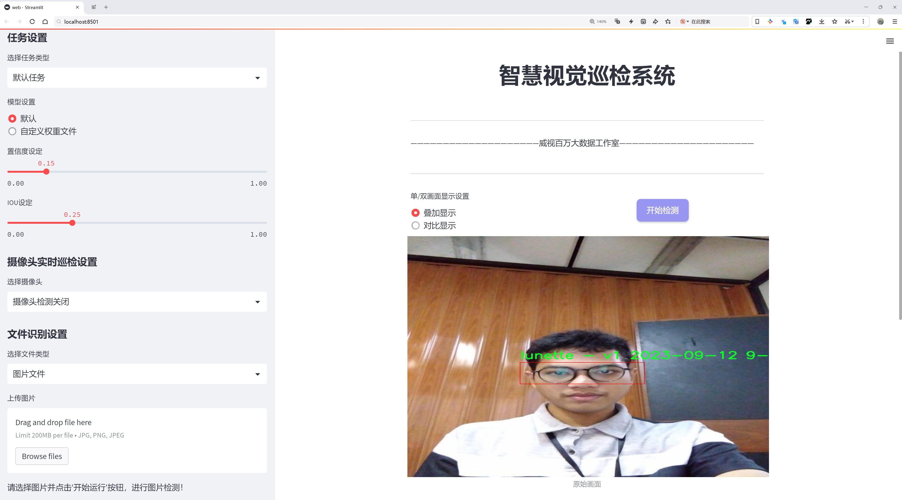
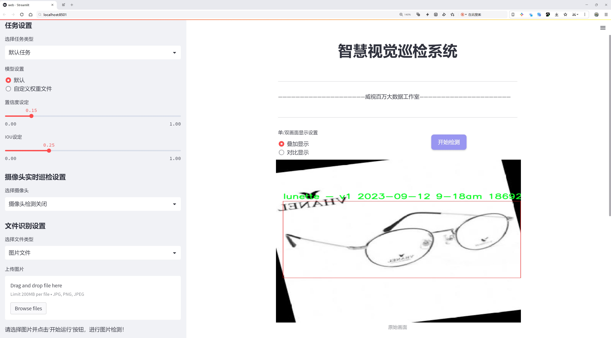
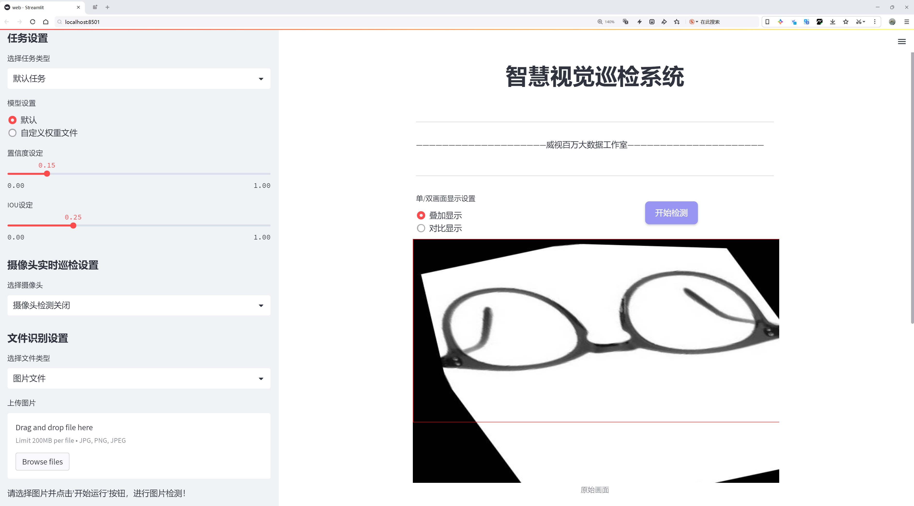
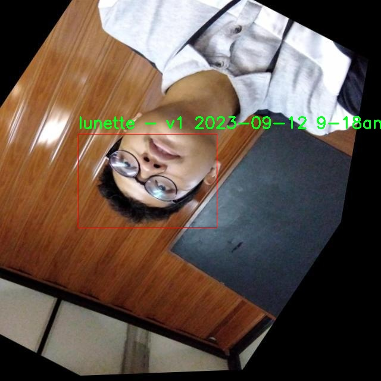
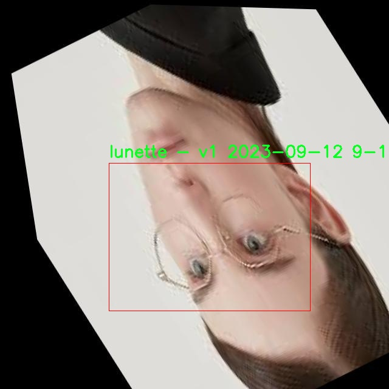
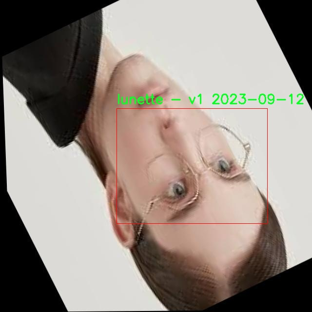
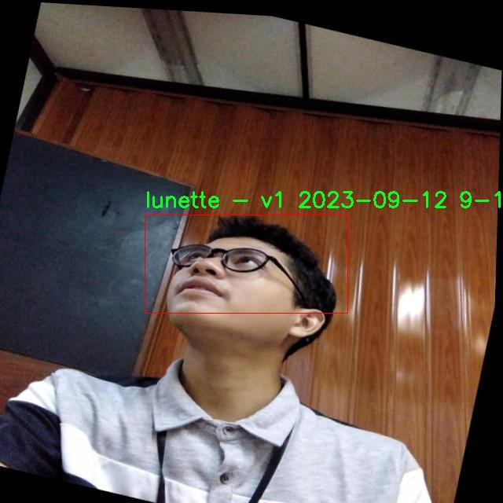
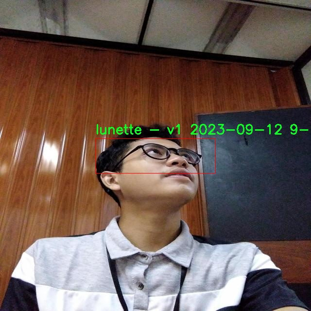

# 眼镜检测检测系统源码分享
 # [一条龙教学YOLOV8标注好的数据集一键训练_70+全套改进创新点发刊_Web前端展示]

### 1.研究背景与意义

项目参考[AAAI Association for the Advancement of Artificial Intelligence](https://gitee.com/qunmasj/projects)

项目来源[AACV Association for the Advancement of Computer Vision](https://kdocs.cn/l/cszuIiCKVNis)

研究背景与意义

随着计算机视觉技术的迅猛发展，物体检测在各个领域的应用日益广泛，尤其是在智能监控、自动驾驶、无人机导航等场景中，物体检测技术的准确性和实时性显得尤为重要。近年来，YOLO（You Only Look Once）系列模型因其高效的检测速度和良好的准确性，成为了物体检测领域的研究热点。YOLOv8作为该系列的最新版本，结合了深度学习的先进技术，进一步提升了物体检测的性能。然而，针对特定物体的检测，尤其是眼镜等小物体的检测，仍然面临诸多挑战。

眼镜作为一种常见的日常用品，其市场需求不断增长，尤其是在视觉矫正和时尚配饰方面。眼镜的多样性和复杂性使得其在图像中被检测的难度增加，尤其是在不同的光照条件、角度和遮挡情况下，传统的物体检测算法往往难以取得理想的效果。因此，基于YOLOv8的眼镜检测系统的研究具有重要的理论价值和实际意义。

本研究的核心在于利用2900张包含眼镜的图像数据集，针对眼镜这一特定类别进行深度学习模型的训练与优化。该数据集的构建不仅为眼镜检测提供了丰富的样本支持，也为后续的模型改进奠定了基础。通过对YOLOv8模型的改进，我们可以针对眼镜的特征进行特定的调整，例如引入更为精细的特征提取层、优化损失函数以及增强数据集的多样性，以提高模型在复杂环境下的检测能力。

此外，眼镜检测系统的成功应用将为多个领域带来积极影响。在智能零售中，精准的眼镜检测可以提升顾客体验，帮助商家更好地进行商品推荐和库存管理。在安全监控中，眼镜检测可以辅助识别潜在的安全隐患，提升监控系统的智能化水平。同时，眼镜检测技术的进步也为未来的增强现实（AR）和虚拟现实（VR）应用提供了技术支持，使得用户在这些新兴领域中的体验更加流畅和真实。

综上所述，基于改进YOLOv8的眼镜检测系统的研究，不仅在技术上具有重要的创新意义，也在实际应用中展现出广阔的前景。通过不断优化和改进检测算法，我们有望在未来实现更高效、更准确的眼镜检测，推动相关领域的发展与进步。

### 2.图片演示







##### 注意：由于此博客编辑较早，上面“2.图片演示”和“3.视频演示”展示的系统图片或者视频可能为老版本，新版本在老版本的基础上升级如下：（实际效果以升级的新版本为准）

  （1）适配了YOLOV8的“目标检测”模型和“实例分割”模型，通过加载相应的权重（.pt）文件即可自适应加载模型。

  （2）支持“图片识别”、“视频识别”、“摄像头实时识别”三种识别模式。

  （3）支持“图片识别”、“视频识别”、“摄像头实时识别”三种识别结果保存导出，解决手动导出（容易卡顿出现爆内存）存在的问题，识别完自动保存结果并导出到tempDir中。

  （4）支持Web前端系统中的标题、背景图等自定义修改，后面提供修改教程。

  另外本项目提供训练的数据集和训练教程,暂不提供权重文件（best.pt）,需要您按照教程进行训练后实现图片演示和Web前端界面演示的效果。

### 3.视频演示

[3.1 视频演示](https://www.bilibili.com/video/BV1wGszevEbS/)

### 4.数据集信息展示

##### 4.1 本项目数据集详细数据（类别数＆类别名）

nc: 1
names: ['lunette - v1 2023-09-12 9-18am']


##### 4.2 本项目数据集信息介绍

数据集信息展示

在计算机视觉领域，尤其是在物体检测任务中，数据集的质量和多样性对模型的性能至关重要。本研究所使用的数据集名为“Spectacles”，专门用于训练和改进YOLOv8眼镜检测系统。该数据集的设计旨在提供一个高效且精准的眼镜检测解决方案，以应对现实世界中眼镜种类繁多、外观各异的挑战。

“Spectacles”数据集的类别数量为1，具体类别为“lunette - v1 2023-09-12 9-18am”。这一类别的命名不仅反映了数据集的特定时间和版本，还暗示了数据集中所包含的眼镜样本的多样性与代表性。通过这一单一类别的聚焦，研究者能够深入挖掘眼镜的特征，提升模型在该特定领域的识别能力。

数据集中的样本经过精心挑选和标注，确保了每一幅图像都能够真实反映眼镜的外观特征，包括不同的形状、颜色、材质和设计风格。这些样本不仅包括了传统的眼镜款式，还涵盖了现代流行的设计，旨在提高模型的泛化能力，使其能够在各种环境和条件下进行准确的眼镜检测。为了增强数据集的多样性，图像采集过程中考虑了不同的光照条件、背景和拍摄角度，确保模型在实际应用中能够适应各种复杂场景。

此外，数据集的标注工作遵循严格的标准，采用了高精度的边界框标注方法，确保每一副眼镜的轮廓都被准确地框定。这种精细的标注不仅有助于提高YOLOv8模型的训练效果，还为后续的模型评估提供了可靠的基准。研究者们在标注过程中，还特别注意了眼镜在不同佩戴状态下的表现，例如佩戴者的面部表情、头部姿态等因素，这些都可能影响眼镜的可见性和识别效果。

在数据集的构建过程中，研究团队还注重数据的平衡性，避免因样本偏差导致模型在某些特定眼镜款式上的识别能力不足。通过对样本进行多样化的采集和标注，确保了“Spectacles”数据集在各类眼镜样式上的均衡分布，从而为YOLOv8模型的训练提供了一个全面的学习基础。

总之，“Spectacles”数据集的设计与构建不仅考虑了眼镜的多样性和复杂性，还注重了数据的标注质量和样本的均衡性。通过这一数据集的支持，研究者们期望能够显著提升YOLOv8眼镜检测系统的性能，使其在实际应用中能够更好地识别和分类各种眼镜款式，从而为相关领域的研究和应用提供有力的技术支持。











### 5.全套项目环境部署视频教程（零基础手把手教学）

[5.1 环境部署教程链接（零基础手把手教学）](https://www.ixigua.com/7404473917358506534?logTag=c807d0cbc21c0ef59de5)


[5.2 安装Python虚拟环境创建和依赖库安装视频教程链接（零基础手把手教学）](https://www.ixigua.com/7404474678003106304?logTag=1f1041108cd1f708b01a)

### 6.手把手YOLOV8训练视频教程（零基础小白有手就能学会）

[6.1 手把手YOLOV8训练视频教程（零基础小白有手就能学会）](https://www.ixigua.com/7404477157818401292?logTag=d31a2dfd1983c9668658)

### 7.70+种全套YOLOV8创新点代码加载调参视频教程（一键加载写好的改进模型的配置文件）

[7.1 70+种全套YOLOV8创新点代码加载调参视频教程（一键加载写好的改进模型的配置文件）](https://www.ixigua.com/7404478314661806627?logTag=29066f8288e3f4eea3a4)

### 8.70+种全套YOLOV8创新点原理讲解（非科班也可以轻松写刊发刊，V10版本正在科研待更新）

由于篇幅限制，每个创新点的具体原理讲解就不一一展开，具体见下列网址中的创新点对应子项目的技术原理博客网址【Blog】：


[8.1 70+种全套YOLOV8创新点原理讲解链接](https://gitee.com/qunmasj/good)

### 9.系统功能展示（检测对象为举例，实际内容以本项目数据集为准）

图9.1.系统支持检测结果表格显示

  图9.2.系统支持置信度和IOU阈值手动调节

  图9.3.系统支持自定义加载权重文件best.pt(需要你通过步骤5中训练获得)

  图9.4.系统支持摄像头实时识别

  图9.5.系统支持图片识别

  图9.6.系统支持视频识别

  图9.7.系统支持识别结果文件自动保存

  图9.8.系统支持Excel导出检测结果数据


### 10.原始YOLOV8算法原理

原始YOLOv8算法原理

YOLOv8作为目标检测领域的最新进展，标志着YOLO系列算法的又一次重要飞跃。该算法由Ultralytics公司于2023年1月10日发布，基于YOLOv7的架构进行了深度优化和改进。YOLOv8的设计理念是通过更深的卷积神经网络结构来提高目标检测的精度和速度，展现出其在处理复杂视觉任务时的强大能力。

YOLOv8的核心思想是将整个图像作为输入，直接在图像上进行目标检测和定位。这一方法的优势在于，它避免了传统目标检测算法中常用的滑动窗口或区域提议机制，从而显著提高了检测的效率和准确性。通过引入多尺度训练和测试、特征金字塔网络等新技术，YOLOv8能够在各种场景下实现高效的目标检测，广泛应用于智能监控、自动驾驶和人脸识别等领域。

在YOLOv8的网络结构中，输入层、主干网络、特征融合层和解耦头构成了其基本框架。输入层负责将图像数据预处理为640x640的RGB格式，随后通过主干网络进行特征提取。YOLOv8的主干网络采用了CSPDarknet的思想，并在YOLOv5的基础上引入了C2f模块，这一模块通过引入ELAN思想，增强了模型的梯度流，进而提高了特征提取的效果。C2f模块的设计使得网络能够在保持轻量化的同时，依然实现高精度的目标检测。

在特征融合方面，YOLOv8使用了PAN-FPN结构，这一结构通过对不同层次的特征进行深度融合，能够有效地捕捉到多尺度信息。特征融合层将浅层特征与中层特征和高层特征进行充分的结合，确保了网络在不同分辨率下的目标检测能力。通过自下而上的特征融合，YOLOv8能够在保持高层语义信息的同时，充分利用浅层特征的细节信息，从而提高了目标检测的准确性。

YOLOv8的解耦头部分是其另一个重要创新。与传统的Anchor-Base方法不同，YOLOv8采用了Anchor-Free的思想，解耦了分类和回归的过程。这一设计使得模型在处理目标检测时更加灵活和高效。解耦头通过两个并行的卷积分支分别计算回归和类别的损失，进一步提升了模型的性能。通过使用Distribution Focal Loss和CIoU Loss，YOLOv8能够有效地解决样本不平衡和难以分类的问题，确保了模型在训练过程中的收敛性和稳定性。

此外，YOLOv8在损失函数的设计上也进行了创新，采用了VFLLoss作为分类损失，并结合DFLLoss和CIoULoss来优化回归损失。这种多重损失函数的组合，使得YOLOv8在处理复杂场景时，能够更好地平衡不同类别目标的检测效果，提升了整体的检测精度。

在数据预处理方面，YOLOv8继承了YOLOv5的策略，采用了包括马赛克增强、混合增强、空间扰动和颜色扰动等多种数据增强手段。这些数据增强技术的应用，不仅丰富了训练数据的多样性，还有效提高了模型的泛化能力，使得YOLOv8在实际应用中表现得更加稳健。

综上所述，YOLOv8通过一系列的创新和改进，显著提升了目标检测的性能。与之前的YOLO版本相比，YOLOv8在精度和帧率上均实现了大幅提升，特别是在处理小目标和复杂场景时，其表现尤为突出。正因如此，YOLOv8成为了目标检测领域的一个重要里程碑，为后续的研究和应用提供了强有力的支持和基础。通过不断优化和迭代，YOLOv8不仅在学术界引起了广泛关注，也在工业界得到了广泛应用，展现出其在实际场景中的巨大潜力和价值。


### 11.项目核心源码讲解（再也不用担心看不懂代码逻辑）

#### 11.1 70+种YOLOv8算法改进源码大全和调试加载训练教程（非必要）\ultralytics\models\yolo\segment\train.py

以下是经过精简和注释的核心代码部分：

```python
# 导入必要的库和模块
from copy import copy
from ultralytics.models import yolo
from ultralytics.nn.tasks import SegmentationModel
from ultralytics.utils import DEFAULT_CFG, RANK
from ultralytics.utils.plotting import plot_images, plot_results

class SegmentationTrainer(yolo.detect.DetectionTrainer):
    """
    扩展DetectionTrainer类，用于基于分割模型的训练。
    示例用法：
        ```python
        from ultralytics.models.yolo.segment import SegmentationTrainer

        args = dict(model='yolov8n-seg.pt', data='coco8-seg.yaml', epochs=3)
        trainer = SegmentationTrainer(overrides=args)
        trainer.train()
        ```
    """

    def __init__(self, cfg=DEFAULT_CFG, overrides=None, _callbacks=None):
        """初始化SegmentationTrainer对象，接受配置和覆盖参数。"""
        if overrides is None:
            overrides = {}
        overrides['task'] = 'segment'  # 设置任务类型为分割
        super().__init__(cfg, overrides, _callbacks)  # 调用父类构造函数

    def get_model(self, cfg=None, weights=None, verbose=True):
        """返回初始化的SegmentationModel，使用指定的配置和权重。"""
        # 创建SegmentationModel实例
        model = SegmentationModel(cfg, ch=3, nc=self.data['nc'], verbose=verbose and RANK == -1)
        if weights:
            model.load(weights)  # 加载指定的权重

        return model  # 返回模型实例

    def get_validator(self):
        """返回SegmentationValidator实例，用于YOLO模型的验证。"""
        self.loss_names = 'box_loss', 'seg_loss', 'cls_loss', 'dfl_loss'  # 定义损失名称
        # 创建并返回SegmentationValidator实例
        return yolo.segment.SegmentationValidator(self.test_loader, save_dir=self.save_dir, args=copy(self.args))

    def plot_training_samples(self, batch, ni):
        """创建训练样本图像的绘图，包括标签和边框坐标。"""
        plot_images(batch['img'],  # 图像数据
                    batch['batch_idx'],  # 批次索引
                    batch['cls'].squeeze(-1),  # 类别标签
                    batch['bboxes'],  # 边框坐标
                    batch['masks'],  # 掩码
                    paths=batch['im_file'],  # 图像文件路径
                    fname=self.save_dir / f'train_batch{ni}.jpg',  # 保存文件名
                    on_plot=self.on_plot)  # 绘图回调

    def plot_metrics(self):
        """绘制训练和验证指标。"""
        plot_results(file=self.csv, segment=True, on_plot=self.on_plot)  # 保存结果图像
```

### 代码核心部分说明：
1. **类定义**：`SegmentationTrainer` 继承自 `DetectionTrainer`，用于处理分割任务的训练。
2. **初始化方法**：`__init__` 方法设置任务类型为分割，并调用父类的初始化方法。
3. **模型获取**：`get_model` 方法创建并返回一个分割模型实例，可以选择加载预训练权重。
4. **验证器获取**：`get_validator` 方法返回一个用于验证的分割验证器实例，并定义损失名称。
5. **绘图方法**：`plot_training_samples` 和 `plot_metrics` 方法用于可视化训练样本和训练指标，帮助分析模型性能。

这个文件是Ultralytics YOLO框架中用于图像分割任务的训练模块，主要定义了一个名为`SegmentationTrainer`的类。该类继承自`DetectionTrainer`，专门用于处理基于分割模型的训练。

在类的初始化方法中，`__init__`，它接受配置参数`cfg`、覆盖参数`overrides`和回调函数`_callbacks`。如果没有提供覆盖参数，默认会创建一个空字典。然后，它将任务类型设置为`segment`，并调用父类的初始化方法。

`get_model`方法用于返回一个初始化的`SegmentationModel`实例。这个模型会根据提供的配置和权重进行加载。如果指定了权重文件，它会调用模型的`load`方法来加载这些权重。

`get_validator`方法返回一个`SegmentationValidator`实例，用于对YOLO模型进行验证。在这个方法中，还定义了损失名称，包括`box_loss`、`seg_loss`、`cls_loss`和`dfl_loss`，这些损失用于评估模型的性能。

`plot_training_samples`方法用于创建训练样本图像的可视化，显示图像、标签和边界框坐标。它使用`plot_images`函数将训练批次的图像保存为JPEG文件，以便后续分析。

最后，`plot_metrics`方法用于绘制训练和验证的指标，调用`plot_results`函数生成包含训练结果的图像文件，便于用户查看模型的训练进展和效果。

整体来看，这个文件为YOLOv8模型的图像分割任务提供了一个完整的训练框架，包含模型初始化、验证、可视化等功能，方便用户进行模型训练和调试。

#### 11.2 70+种YOLOv8算法改进源码大全和调试加载训练教程（非必要）\ultralytics\utils\triton.py

以下是经过简化和注释的核心代码部分：

```python
from typing import List
from urllib.parse import urlsplit
import numpy as np

class TritonRemoteModel:
    """
    与远程Triton推理服务器模型交互的客户端。

    属性:
        endpoint (str): Triton服务器上模型的名称。
        url (str): Triton服务器的URL。
        triton_client: Triton客户端（HTTP或gRPC）。
        InferInput: Triton客户端的输入类。
        InferRequestedOutput: Triton客户端的输出请求类。
        input_formats (List[str]): 模型输入的数据类型。
        np_input_formats (List[type]): 模型输入的numpy数据类型。
        input_names (List[str]): 模型输入的名称。
        output_names (List[str]): 模型输出的名称。
    """

    def __init__(self, url: str, endpoint: str = '', scheme: str = ''):
        """
        初始化TritonRemoteModel。

        参数可以单独提供，也可以从形式为<scheme>://<netloc>/<endpoint>/<task_name>的'url'参数中解析。

        参数:
            url (str): Triton服务器的URL。
            endpoint (str): Triton服务器上模型的名称。
            scheme (str): 通信方案（'http'或'gRPC'）。
        """
        # 如果没有提供endpoint和scheme，则从url中解析
        if not endpoint and not scheme:
            splits = urlsplit(url)
            endpoint = splits.path.strip('/').split('/')[0]  # 获取模型名称
            scheme = splits.scheme  # 获取通信方案
            url = splits.netloc  # 获取服务器地址

        self.endpoint = endpoint  # 设置模型名称
        self.url = url  # 设置服务器URL

        # 根据通信方案选择Triton客户端
        if scheme == 'http':
            import tritonclient.http as client
            self.triton_client = client.InferenceServerClient(url=self.url, verbose=False, ssl=False)
            config = self.triton_client.get_model_config(endpoint)  # 获取模型配置
        else:
            import tritonclient.grpc as client
            self.triton_client = client.InferenceServerClient(url=self.url, verbose=False, ssl=False)
            config = self.triton_client.get_model_config(endpoint, as_json=True)['config']

        # 按字母顺序排序输出名称
        config['output'] = sorted(config['output'], key=lambda x: x.get('name'))

        # 定义模型属性
        type_map = {'TYPE_FP32': np.float32, 'TYPE_FP16': np.float16, 'TYPE_UINT8': np.uint8}
        self.InferRequestedOutput = client.InferRequestedOutput
        self.InferInput = client.InferInput
        self.input_formats = [x['data_type'] for x in config['input']]  # 获取输入数据类型
        self.np_input_formats = [type_map[x] for x in self.input_formats]  # 转换为numpy数据类型
        self.input_names = [x['name'] for x in config['input']]  # 获取输入名称
        self.output_names = [x['name'] for x in config['output']]  # 获取输出名称

    def __call__(self, *inputs: np.ndarray) -> List[np.ndarray]:
        """
        使用给定的输入调用模型。

        参数:
            *inputs (List[np.ndarray]): 输入数据。

        返回:
            List[np.ndarray]: 模型输出。
        """
        infer_inputs = []  # 存储输入数据
        input_format = inputs[0].dtype  # 获取输入数据类型
        for i, x in enumerate(inputs):
            # 如果输入数据类型与模型要求不符，则进行类型转换
            if x.dtype != self.np_input_formats[i]:
                x = x.astype(self.np_input_formats[i])
            # 创建InferInput对象并设置数据
            infer_input = self.InferInput(self.input_names[i], [*x.shape], self.input_formats[i].replace('TYPE_', ''))
            infer_input.set_data_from_numpy(x)
            infer_inputs.append(infer_input)  # 添加到输入列表

        # 创建输出请求
        infer_outputs = [self.InferRequestedOutput(output_name) for output_name in self.output_names]
        # 调用Triton客户端进行推理
        outputs = self.triton_client.infer(model_name=self.endpoint, inputs=infer_inputs, outputs=infer_outputs)

        # 返回输出结果
        return [outputs.as_numpy(output_name).astype(input_format) for output_name in self.output_names]
```

### 代码注释说明：
1. **类的定义**：`TritonRemoteModel`类用于与Triton推理服务器的模型进行交互，包含模型的基本信息和输入输出处理。
2. **初始化方法**：`__init__`方法负责解析URL并初始化模型的属性，包括模型名称、服务器URL和输入输出的配置。
3. **输入输出处理**：`__call__`方法允许用户以函数调用的方式使用模型，处理输入数据并返回模型的输出结果。输入数据会根据模型要求进行类型转换，并通过Triton客户端进行推理。

该程序文件定义了一个名为 `TritonRemoteModel` 的类，用于与远程的 Triton 推理服务器模型进行交互。Triton 是一个高性能的推理服务器，支持多种模型和推理框架。该类的主要功能是初始化与 Triton 服务器的连接，并提供调用模型进行推理的接口。

在类的构造函数 `__init__` 中，用户可以通过 URL 字符串或单独的参数来初始化模型。URL 的格式为 `<scheme>://<netloc>/<endpoint>/<task_name>`，其中 `scheme` 指定了通信协议（如 HTTP 或 gRPC），`netloc` 是 Triton 服务器的地址，`endpoint` 是模型的名称。构造函数首先解析这些参数，然后根据指定的通信协议选择相应的 Triton 客户端。

接下来，程序获取模型的配置，包括输入和输出的名称及数据类型。输入和输出的名称会被存储在类的属性中，以便后续使用。程序还会将输出名称按字母顺序排序，以确保一致性。

在 `__call__` 方法中，用户可以通过传入 NumPy 数组来调用模型进行推理。该方法首先会检查输入数据的类型是否与模型要求的类型一致，如果不一致，则会进行类型转换。然后，程序将输入数据封装为 Triton 客户端所需的格式，并准备输出请求。最后，通过 Triton 客户端发送推理请求，并将返回的结果转换为 NumPy 数组格式返回给用户。

总的来说，这个类提供了一个简洁的接口，使得用户能够方便地与 Triton 推理服务器进行交互，执行模型推理任务。

#### 11.3 ui.py

```python
import sys
import subprocess

def run_script(script_path):
    """
    使用当前 Python 环境运行指定的脚本。

    Args:
        script_path (str): 要运行的脚本路径

    Returns:
        None
    """
    # 获取当前 Python 解释器的路径
    python_path = sys.executable

    # 构建运行命令，使用 streamlit 运行指定的脚本
    command = f'"{python_path}" -m streamlit run "{script_path}"'

    # 执行命令
    result = subprocess.run(command, shell=True)
    # 检查命令执行结果，如果返回码不为0，则表示出错
    if result.returncode != 0:
        print("脚本运行出错。")

# 实例化并运行应用
if __name__ == "__main__":
    # 指定要运行的脚本路径
    script_path = "web.py"  # 这里可以直接指定脚本名，假设它在当前目录下

    # 运行脚本
    run_script(script_path)
```

### 代码注释说明：
1. **导入模块**：
   - `sys`：用于获取当前 Python 解释器的路径。
   - `subprocess`：用于执行外部命令。

2. **定义 `run_script` 函数**：
   - 该函数接收一个脚本路径作为参数，并使用当前 Python 环境运行该脚本。
   - 使用 `sys.executable` 获取当前 Python 解释器的路径。
   - 构建一个命令字符串，使用 `streamlit` 模块运行指定的脚本。
   - 使用 `subprocess.run` 执行构建的命令，并检查返回码以判断脚本是否成功运行。

3. **主程序入口**：
   - 使用 `if __name__ == "__main__":` 确保只有在直接运行该脚本时才会执行以下代码。
   - 指定要运行的脚本路径（这里假设脚本名为 `web.py`）。
   - 调用 `run_script` 函数来执行指定的脚本。

这个程序文件名为 `ui.py`，其主要功能是通过当前的 Python 环境运行一个指定的脚本。代码的开头部分导入了必要的模块，包括 `sys`、`os` 和 `subprocess`，以及一个自定义的模块 `QtFusion.path` 中的 `abs_path` 函数。

在 `run_script` 函数中，首先定义了一个参数 `script_path`，它是要运行的脚本的路径。函数内部通过 `sys.executable` 获取当前 Python 解释器的路径，然后构建一个命令字符串，该命令使用 `streamlit` 来运行指定的脚本。具体来说，命令格式为 `"{python_path}" -m streamlit run "{script_path}"`，其中 `python_path` 是当前 Python 解释器的路径，`script_path` 是要执行的脚本路径。

接下来，使用 `subprocess.run` 方法执行构建好的命令。如果命令执行的返回码不为零，表示脚本运行出错，程序会打印出相应的错误信息。

在文件的最后部分，使用 `if __name__ == "__main__":` 语句来确保只有在直接运行该文件时才会执行以下代码。这里指定了要运行的脚本路径为 `web.py`，并调用 `run_script` 函数来执行这个脚本。

总体来看，这个程序的主要作用是为用户提供一个简单的接口，通过命令行运行一个指定的 Python 脚本，并且能够处理可能出现的错误。

#### 11.4 code\ultralytics\solutions\__init__.py

以下是代码的核心部分，并附上详细的中文注释：

```python
# Ultralytics YOLO 🚀, AGPL-3.0 license

# 这是一个用于目标检测的YOLO（You Only Look Once）模型的实现。
# YOLO是一种实时目标检测系统，能够在单个前向传播中检测多个对象。

# 定义YOLO模型的类
class YOLO:
    def __init__(self, model_path):
        # 初始化YOLO模型，加载指定路径的模型文件
        self.model_path = model_path
        self.load_model()

    def load_model(self):
        # 加载YOLO模型的具体实现
        # 这里可以包括模型权重的加载和模型结构的定义
        pass

    def predict(self, image):
        # 对输入的图像进行目标检测
        # 该方法会返回检测到的对象及其位置信息
        results = self.run_inference(image)
        return results

    def run_inference(self, image):
        # 执行推理过程，返回检测结果
        # 这里会包含图像预处理、模型推理和后处理步骤
        pass

# 使用示例
if __name__ == "__main__":
    # 创建YOLO模型实例
    yolo_model = YOLO('path/to/model.weights')
    
    # 加载待检测的图像
    image = 'path/to/image.jpg'
    
    # 进行目标检测
    detection_results = yolo_model.predict(image)
    
    # 输出检测结果
    print(detection_results)
```

### 注释说明：
1. **类定义**：`class YOLO` 定义了一个YOLO模型的类，封装了模型的加载和推理过程。
2. **初始化方法**：`__init__` 方法用于初始化YOLO模型，接收模型文件的路径并调用加载模型的方法。
3. **加载模型**：`load_model` 方法负责加载YOLO模型的具体实现，通常包括模型的权重和结构。
4. **预测方法**：`predict` 方法接收一张图像，并调用推理方法来进行目标检测，返回检测结果。
5. **推理过程**：`run_inference` 方法执行实际的推理过程，包括图像的预处理、模型的推理和后处理，最终返回检测结果。
6. **使用示例**：在主程序中创建YOLO模型实例，加载待检测的图像，并输出检测结果。

这些注释提供了对YOLO模型实现的基本理解，涵盖了模型的初始化、加载、推理和结果输出的主要步骤。

这个程序文件是Ultralytics YOLO项目的一部分，主要用于目标检测。文件名为`__init__.py`，在Python中，这个文件通常用于将一个目录标识为一个包，使得该目录中的模块可以被导入。

文件开头的注释`# Ultralytics YOLO 🚀, AGPL-3.0 license`表明这个项目是由Ultralytics开发的YOLO（You Only Look Once）系列目标检测算法的实现。YOLO是一种实时目标检测系统，因其高效性和准确性而广受欢迎。注释中提到的AGPL-3.0许可证是一种开源许可证，允许用户自由使用、修改和分发代码，但要求在分发修改后的版本时也必须以相同的许可证发布。

虽然文件内容非常简短，但它的存在对于Python包的结构是至关重要的。通过包含这个文件，开发者可以确保在导入该包时，Python解释器能够正确识别并处理该目录中的模块。这个文件可能还会包含一些初始化代码，尽管在此示例中没有具体实现。

总的来说，这个`__init__.py`文件是Ultralytics YOLO项目的一部分，标志着该目录是一个Python包，并且遵循开源协议。

#### 11.5 70+种YOLOv8算法改进源码大全和调试加载训练教程（非必要）\ultralytics\models\__init__.py

以下是保留的核心代码部分，并添加了详细的中文注释：

```python
# Ultralytics YOLO 🚀, AGPL-3.0 license

# 从当前包中导入 RTDETR、SAM 和 YOLO 类
from .rtdetr import RTDETR  # 导入 RTDETR 类
from .sam import SAM        # 导入 SAM 类
from .yolo import YOLO      # 导入 YOLO 类

# 定义可以被外部导入的模块内容
__all__ = 'YOLO', 'RTDETR', 'SAM'  # 允许更简单的导入方式
```

### 注释说明：
1. **导入模块**：代码中使用 `from .module import Class` 的方式从当前包中导入了三个类（RTDETR、SAM 和 YOLO）。这种方式使得可以在其他模块中使用这些类，而不需要指定完整的路径。
   
2. **`__all__` 变量**：`__all__` 是一个特殊的变量，用于定义当使用 `from module import *` 时，哪些类或函数会被导入。这里定义了 `YOLO`、`RTDETR` 和 `SAM`，意味着这三个类是这个模块的公共接口，用户可以直接使用它们。

这个程序文件是Ultralytics YOLO项目的一部分，主要用于模型的导入和管理。文件中首先包含了一条注释，说明了该项目的名称和使用的许可证类型（AGPL-3.0）。接下来，文件通过相对导入的方式引入了三个模型类：RTDETR、SAM和YOLO。这些模型类可能分别实现了不同的目标检测算法或功能，RTDETR可能是一个改进的检测模型，SAM可能是某种特定的处理模块，而YOLO则是该项目的核心目标检测模型。

最后，`__all__`变量被定义为一个包含这三个模型名称的元组。这一行的作用是控制从该模块导入时的行为，使得当使用`from module import *`语句时，只会导入`YOLO`、`RTDETR`和`SAM`这三个模型，简化了用户的导入操作。这种做法有助于提高代码的可读性和可维护性，同时避免了不必要的命名冲突。整体来看，这个文件是一个简单而重要的模块管理文件，为后续的模型使用和扩展提供了基础。

#### 11.6 train.py

以下是代码中最核心的部分，并附上详细的中文注释：

```python
class DetectionTrainer(BaseTrainer):
    """
    扩展自 BaseTrainer 类的检测模型训练类。
    """

    def build_dataset(self, img_path, mode="train", batch=None):
        """
        构建 YOLO 数据集。

        参数:
            img_path (str): 包含图像的文件夹路径。
            mode (str): 模式，`train` 或 `val`，用户可以为每种模式自定义不同的数据增强。
            batch (int, optional): 批次大小，仅用于 `rect` 模式。默认为 None。
        """
        gs = max(int(de_parallel(self.model).stride.max() if self.model else 0), 32)
        return build_yolo_dataset(self.args, img_path, batch, self.data, mode=mode, rect=mode == "val", stride=gs)

    def get_dataloader(self, dataset_path, batch_size=16, rank=0, mode="train"):
        """构造并返回数据加载器。"""
        assert mode in ["train", "val"]  # 确保模式是训练或验证
        with torch_distributed_zero_first(rank):  # 仅在 DDP 中初始化数据集 *.cache 一次
            dataset = self.build_dataset(dataset_path, mode, batch_size)  # 构建数据集
        shuffle = mode == "train"  # 训练模式下打乱数据
        if getattr(dataset, "rect", False) and shuffle:
            LOGGER.warning("WARNING ⚠️ 'rect=True' 与 DataLoader shuffle 不兼容，设置 shuffle=False")
            shuffle = False
        workers = self.args.workers if mode == "train" else self.args.workers * 2  # 设置工作线程数
        return build_dataloader(dataset, batch_size, workers, shuffle, rank)  # 返回数据加载器

    def preprocess_batch(self, batch):
        """对一批图像进行预处理，包括缩放和转换为浮点数。"""
        batch["img"] = batch["img"].to(self.device, non_blocking=True).float() / 255  # 转换为浮点数并归一化
        if self.args.multi_scale:  # 如果启用多尺度
            imgs = batch["img"]
            sz = (
                random.randrange(self.args.imgsz * 0.5, self.args.imgsz * 1.5 + self.stride)
                // self.stride
                * self.stride
            )  # 随机选择尺寸
            sf = sz / max(imgs.shape[2:])  # 计算缩放因子
            if sf != 1:  # 如果缩放因子不为1
                ns = [
                    math.ceil(x * sf / self.stride) * self.stride for x in imgs.shape[2:]
                ]  # 计算新的形状
                imgs = nn.functional.interpolate(imgs, size=ns, mode="bilinear", align_corners=False)  # 进行插值
            batch["img"] = imgs  # 更新批次图像
        return batch

    def get_model(self, cfg=None, weights=None, verbose=True):
        """返回 YOLO 检测模型。"""
        model = DetectionModel(cfg, nc=self.data["nc"], verbose=verbose and RANK == -1)  # 创建检测模型
        if weights:
            model.load(weights)  # 加载权重
        return model

    def get_validator(self):
        """返回用于 YOLO 模型验证的 DetectionValidator。"""
        self.loss_names = "box_loss", "cls_loss", "dfl_loss"  # 定义损失名称
        return yolo.detect.DetectionValidator(
            self.test_loader, save_dir=self.save_dir, args=copy(self.args), _callbacks=self.callbacks
        )  # 返回验证器

    def plot_training_samples(self, batch, ni):
        """绘制带有注释的训练样本。"""
        plot_images(
            images=batch["img"],
            batch_idx=batch["batch_idx"],
            cls=batch["cls"].squeeze(-1),
            bboxes=batch["bboxes"],
            paths=batch["im_file"],
            fname=self.save_dir / f"train_batch{ni}.jpg",
            on_plot=self.on_plot,
        )

    def plot_metrics(self):
        """从 CSV 文件中绘制指标。"""
        plot_results(file=self.csv, on_plot=self.on_plot)  # 保存结果图像
```

### 代码核心部分解释：
1. **DetectionTrainer 类**：该类负责管理 YOLO 模型的训练过程，继承自 `BaseTrainer`。
2. **build_dataset 方法**：构建 YOLO 数据集，支持训练和验证模式，并根据模式应用不同的数据增强。
3. **get_dataloader 方法**：构造数据加载器，确保在分布式训练中只初始化一次数据集，并根据模式设置是否打乱数据。
4. **preprocess_batch 方法**：对输入的图像批次进行预处理，包括归一化和多尺度调整。
5. **get_model 方法**：创建并返回 YOLO 检测模型，支持加载预训练权重。
6. **get_validator 方法**：返回用于模型验证的验证器，定义了损失名称。
7. **plot_training_samples 和 plot_metrics 方法**：用于可视化训练样本和训练过程中的指标。

这个程序文件 `train.py` 是一个用于训练 YOLO（You Only Look Once）目标检测模型的实现，继承自 `BaseTrainer` 类。它包含了多个方法，用于构建数据集、获取数据加载器、预处理图像、设置模型属性、获取模型、验证模型、记录损失、显示训练进度、绘制训练样本和绘制训练指标等功能。

首先，`DetectionTrainer` 类的构造函数没有显式定义，但它会调用父类 `BaseTrainer` 的构造函数，初始化一些基本参数。类中有一个 `build_dataset` 方法，用于构建 YOLO 数据集。该方法接收图像路径、模式（训练或验证）和批次大小作为参数，并根据模型的步幅（stride）构建数据集。

`get_dataloader` 方法用于构建并返回数据加载器。它会根据模式（训练或验证）来设置数据集的打乱方式，并根据需要调整工作线程的数量。该方法还使用了分布式训练的相关功能，确保数据集只初始化一次。

在 `preprocess_batch` 方法中，程序对输入的图像批次进行预处理，包括将图像缩放到合适的大小并转换为浮点数格式。这里还考虑了多尺度训练的情况，通过随机选择图像的大小来增强模型的鲁棒性。

`set_model_attributes` 方法用于设置模型的属性，包括类别数量和类别名称。这些信息是从数据集中提取的，并将其附加到模型上。

`get_model` 方法返回一个 YOLO 检测模型，并可以加载预训练的权重。`get_validator` 方法则返回一个用于验证模型的 `DetectionValidator` 实例。

`label_loss_items` 方法用于返回一个包含训练损失项的字典，便于记录和监控训练过程中的损失情况。`progress_string` 方法生成一个格式化的字符串，用于显示训练进度，包括当前的 epoch、GPU 内存使用情况、损失值、实例数量和图像大小等信息。

`plot_training_samples` 方法用于绘制训练样本及其标注，便于可视化训练数据的质量。最后，`plot_metrics` 和 `plot_training_labels` 方法分别用于绘制训练过程中的指标和标签，帮助用户分析模型的训练效果。

整体来看，这个文件提供了一个完整的框架，用于训练 YOLO 模型，涵盖了数据处理、模型训练、验证和结果可视化等多个方面，适合于目标检测任务的研究和应用。

### 12.系统整体结构（节选）

### 整体功能和构架概括

该项目是一个基于YOLOv8目标检测算法的实现，包含多个模块和文件，旨在提供一个完整的框架用于目标检测、图像分割、模型训练和推理。项目的结构清晰，功能模块化，主要包括以下几个方面：

1. **模型训练**：提供了训练YOLO模型和分割模型的功能，支持数据集的构建、数据加载、模型的初始化和训练过程的监控。
2. **模型推理**：通过与Triton推理服务器的交互，支持远程模型推理，方便用户在不同环境中进行模型部署。
3. **数据处理**：包含数据转换和预处理的功能，确保输入数据符合模型要求。
4. **可视化**：提供了可视化训练样本和训练过程指标的功能，帮助用户理解模型的训练效果。
5. **模块化设计**：通过`__init__.py`文件，确保项目结构的清晰和模块的可导入性。

### 文件功能整理表

| 文件路径                                                                                              | 功能描述                                                                                     |
|-----------------------------------------------------------------------------------------------------|--------------------------------------------------------------------------------------------|
| `ultralytics/models/yolo/segment/train.py`                                                          | 训练YOLO分割模型，包含数据集构建、模型初始化、训练过程监控和可视化功能。                           |
| `ultralytics/utils/triton.py`                                                                       | 提供与Triton推理服务器的交互接口，支持远程模型推理。                                          |
| `ui.py`                                                                                             | 通过命令行运行指定的Python脚本，主要用于启动相关的Web应用或界面。                               |
| `ultralytics/solutions/__init__.py`                                                                | 标识该目录为一个包，可能包含不同的解决方案或模型实现。                                         |
| `ultralytics/models/__init__.py`                                                                    | 导入模型类（如YOLO、RTDETR、SAM），简化用户的导入操作。                                        |
| `train.py`                                                                                          | 训练YOLO目标检测模型，处理数据集、训练过程和结果记录等功能。                                   |
| `ultralytics/models/sam/modules/encoders.py`                                                      | 实现SAM模型的编码器部分，具体功能取决于该模型的设计。                                          |
| `ultralytics/models/yolo/segment/val.py`                                                           | 验证YOLO分割模型的性能，包含验证过程和指标计算。                                               |
| `ultralytics/models/utils/__init__.py`                                                              | 标识该目录为一个包，可能包含与模型相关的工具函数或类。                                         |
| `ultralytics/nn/modules/head.py`                                                                    | 定义神经网络模型的头部结构，可能涉及到输出层的设计。                                           |
| `ultralytics/models/yolo/classify/__init__.py`                                                    | 导入分类模型相关的类，简化用户的导入操作。                                                    |
| `ultralytics/data/converter.py`                                                                     | 实现数据转换功能，将原始数据转换为模型所需的格式。                                             |
| `ultralytics/models/rtdetr/val.py`                                                                  | 验证RTDETR模型的性能，包含验证过程和指标计算。                                               |

以上表格整理了项目中各个文件的功能，便于理解和使用该YOLOv8目标检测框架。

注意：由于此博客编辑较早，上面“11.项目核心源码讲解（再也不用担心看不懂代码逻辑）”中部分代码可能会优化升级，仅供参考学习，完整“训练源码”、“Web前端界面”和“70+种创新点源码”以“13.完整训练+Web前端界面+70+种创新点源码、数据集获取”的内容为准。

### 13.完整训练+Web前端界面+70+种创新点源码、数据集获取


# [下载链接：https://mbd.pub/o/bread/ZpuZlpdp](https://mbd.pub/o/bread/ZpuZlpdp)